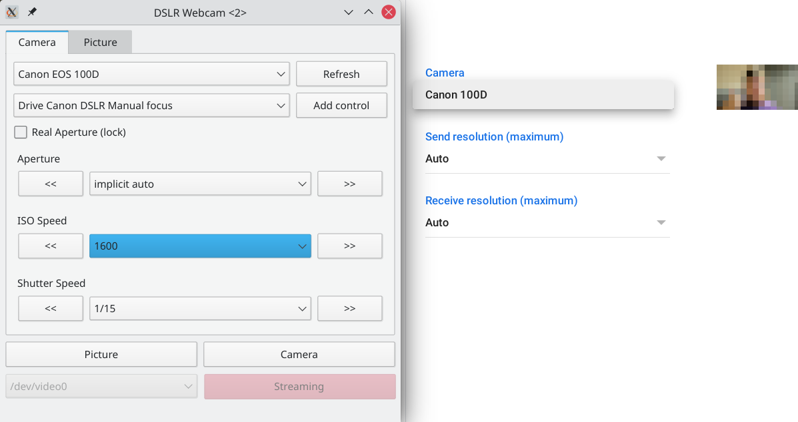

DSLR Webcam is a Linux only utility which turns USB connected DSLR into a
webcam.



# Usage

## v4l2loopback

DSLR Webcam looks for a v4l2loopback video device.

```
modprobe v4l2loopback exclusive_caps=1 video_nr=0 card_label="Label"
```

* `video_nr` configures the number of the device
  * `video_nr=0` will create a device `/dev/video0`, use a different number if
    you have different video devices in your system already.
* `card_label` is the name of the camera in downstream applications such as
  browsers.

## Tested camera models

* Canon 100D (~15 fps)

# Development

## Prerequisites

### pre-commit

To ensure a consistent style this project uses the pre-commit tool.

```bash
pre-commit install
```
